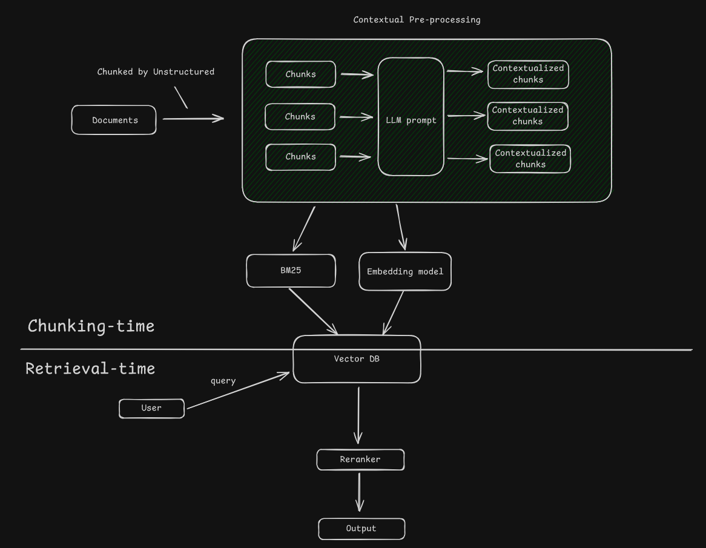

# :robot: Uprag
RAG up, not down

> :warning: tl;dr; use `uprag.henrywan.dev`
>
> If prompted with verification email use `424242`
>
> The deployed instance is only 512MB of ram with 0.1 cpu, so dont stress it :(
>
> can be accessed with the following credentials
> email: test+clerk_test@test.ai
> passowrd: Password123T

## :rocket: Quick start

### Frontend

First, start by installing dependencies
```bash
cd ./frontend
npm install
```

Add the following to your `.env` file in `./frontend`
```bash
# Public key
VITE_CLERK_PUBLISHABLE_KEY=pk_test_Y2hhcm1lZC1tdXNrcmF0LTk0LmNsZXJrLmFjY291bnRzLmRldiQ
VITE_CLERK_JWT_TEMPLATE="auth-template"

VITE_PUBLIC_SERVER_ROUTE=http://localhost:8080/api/v1
```

### Backend

Add the following to your `.env` file in `./backend`
```bash
MONGODB_URL="<your mongodb url>"
MONGODB_DB_NAME="db"

CLERK_JWKS_PUBLIC_KEY="-----BEGIN PUBLIC KEY-----
MIIBIjANBgkqhkiG9w0BAQEFAAOCAQ8AMIIBCgKCAQEAvFNsZoi1liKju59bnDjT
GCdtXM4O+7o2eo4TEj4ItEnm/Se/Po3n0Xnt0i4gC+dctBwQ3DAgbLV1Gp9MyRJl
NBnlMGMN7jd4v8Nl9JiidWnSlNbsSSIUkc8mXNyoxRhTIgqH5RrgHwJ+3nvEiWim
AafQ9Q9cce187ekKUeMeLQjNfPTg8hwz0FvxbrqCI+GJqBJdN12pjCBkeG2/7oLi
p0gZzujoiUtU40E3+xcR0TZbve+C44weKIcwOG0NuaW61kGQ0cY3AveqFel4oip5
HXsZvokX93ewXQ0IPhcQUlwCtBrlHqMwHK9rBnqQEChD4CM6WsL6YsfnkVycjAeh
BwIDAQAB
-----END PUBLIC KEY-----
"

UNSTRUCTURED_API_KEY="<your unstructured api key>"

PINECONE_API_KEY="<your pinecone api key>"

OPENAI_API_KEY="<your open ai api key>"
```

> :bulb: How do I get the keys?
>
> You can get the connection string for `MongoDB` from the [Atlas UI](https://cloud.mongodb.com/).
>
> You can get the keys for `Unstructured` [here](https://unstructured.io/api-key-free)
>
> You can get the keys for `Pinecone` [here](https://www.pinecone.io/start)
>
> You can get the keys for `OpenAI` [here](https://platform.openai.com/account/api-keys)


### Starting the server

Start the server by running
```bash
docker compose -f docker-compose-dev.yaml up --build
```

If you get error regarding docker network collision, run:
```bash
docker network prune
docker compose -f docker-compose-dev.yaml up --force-recreate
```

You can then access the following:
* Frontend: `http://localhost:5173`
* Backend: `http://localhost:8080/docs`

## :seedling: Architecture & design choices

### RAG Agent Architecture


> :warning: Contextual Pre-processing is currently disabled, since I get rate limited. To enable it, change line 50 of `knowledge_service.py` to `res = await parser.generate_contextual_chunks()`

#### Details
* The Document is chunked by Unstructured, with parameter `chunk_overlap=36` and `chunk_size=512`.

* It is originally designed such that chunks are fed into an LLM where context would be added, example:
```python
original_chunk = "This shows that I am extremely fluent in using React, CSS and TypeScript for frontend development."

contextualized_chunk = "This chunk is from Henry's cover letter for a Web Developer Intern role, highlighting his successful completion of a team-based capstone project, for which he was solely responsible for the frontend development.as able to finish all developmental tasks within 10 weeks. This shows that I am extremely fluent in using React, CSS and TypeScript for frontend development."
```

* Embedding model uses `text-embedding-3-large` for better accuracy

* LLM uses `gpt-4o` for better accuracy

* User query is retrieved with combination of dense and sparse vecotrs (BM25) with alpha value of `0.75`

* For information on the prompts, see `./backend/app/utils/prompt_templates`

### API Archidecture

* Consult [http://localhost:8080/docs](http://localhost:8080/docs) for the API documentation

* User endpoint is depricated

## :grimacing: Challenges & Caveats

### Agent Generation
> :warning: It is assumed that the agent is a product to query / summerize documents, it is not allowed to produce / evolve based on the information provided. It can only state the information.

The biggest challenge was to get the agent generate response factually and not to generate non-factual or advice-like responses. Hence the following questions were asked:

1. To prevent off tangent generation (Document: `AI Task - Contract Approval and Signing Requirements.docx`)
```
User: What is a contract in general?
ASSISTANT: <answers stating that no information on contract is available>
```

2. To prevent advisory generation (Document: `AI Task - Contract Approval and Signing Requirements.docx`)
```
User: Should the CEO have limited signing power instead?
ASSISTANT: <answers by stating that it cannot / no info to answer the query>

User: Do you think the CEO should have a limited signing power?
ASSISTANT: <answers by stating that it cannot / no info to answer the query>

User: What should checkbox do to increase their revenue?
ASSISTANT: <answers by stating that it cannot / no info to answer the query>
```

3. To prevent off topic generation (Document: any)
```
USER: Tell me a joke
ASSISTANT: <answers by stating that it cannot / no info to answer the query>

USER: Tell me something cool
ASSISTANT: <answers by stating that it cannot / no info to answer the query>
```

### BM25
From a very quick testing by eyeball, it seems that BM25 provide very little advantage compared to only using dense vector.

The main caveat is that it takes a long time to create and retrieve, hence the value of implementing BM25 is questionable.

### Chunking and Retrieval
Since BM25 is implemented, it takes a long time to create and retrieve, the time is even longer for document `AI Task - Checkbox WhistleBlower Policy - Demo.docx`

### Document Upload
Only `.docx` is supported, uncomment other items in `DEFAULT_ACCEPTED_FILE_TYPES` in `document_parser.py` to enable more support.

### Frontend
After sign up / sign in, the user could get error 401 "Token is not yet valid". The user might have to wait a bit and sign back in again before accessing the application.

## :droplet: Potential Improvements

#### Agents
* Auto prompt optimization (probably with `AdalFlow`)
* Introduce accuracy tetsing
* Add Agentic retrieval
* Experiment with Graph Rag

#### UI & Application layer
* Additional endpoint & websocket such that the frontend could display progress
